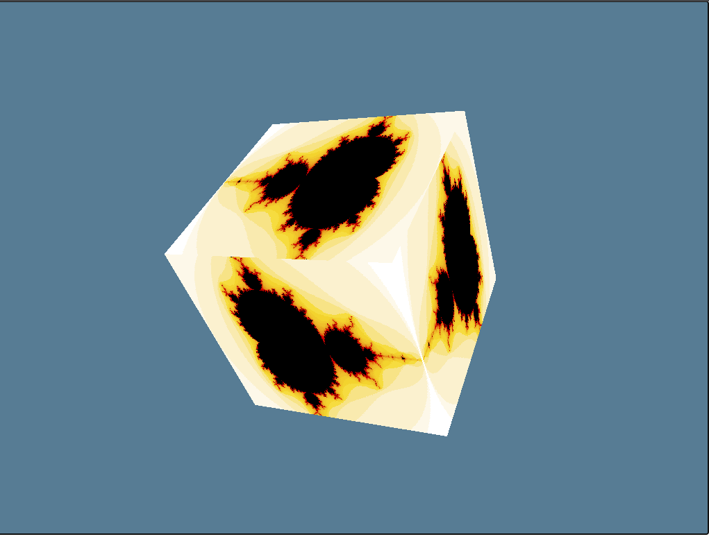

# Webgpu Wasm
a learning repository for testing rust's wgpu on top of wasm. Many parts of the code are heavily inspired directly from 
https://github.com/gfx-rs/wgpu/tree/trunk/examples 

## running native
```bash
cargo run
```

## running in the web 

```bash
RUSTFLAGS=--cfg=web_sys_unstable_apis cargo run-wasm --release --package wgpu-minimal
```

## expected output

